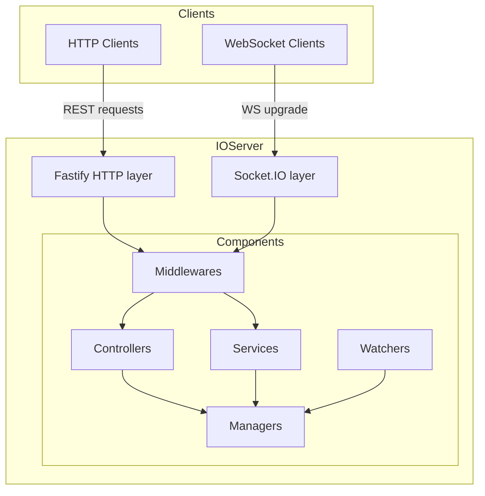

# IOServer

[](https://badge.fury.io/js/ioserver)
[](https://opensource.org/licenses/Apache-2.0)
[](https://github.com/x42en/IOServer/actions)
[](https://codecov.io/gh/x42en/IOServer)
[](https://www.typescriptlang.org/)

A TypeScript framework for building real-time applications, combining [Fastify](https://fastify.dev/) (HTTP) and [Socket.IO](https://socket.io/) (WebSocket) behind a single unified API.

## Overview

IOServer structures your application around five component types — Services, Controllers, Managers, Watchers, and Middlewares — each with a well-defined responsibility. Components are registered on the IOServer instance before startup; the framework wires routing, CORS, and Socket.IO transport automatically.

It is designed to be small, explicit, and easily testable:

- No magic decorators or code generation
- Route definitions are plain JSON files, kept separate from handler logic
- Managers are injectable singletons available to every component via `AppHandle`
- All base classes expose a minimal surface; you only override what you need

## Architecture



## Key Features

- **Unified HTTP + WebSocket** — Fastify v5 and Socket.IO v4 share the same port and TLS configuration
- **Component model** — Five explicit roles (Service, Controller, Manager, Watcher, Middleware) keep business logic isolated and testable
- **JSON route files** — HTTP routes are declared in `.json` files; no annotations or meta-programming required
- **Injectable managers** — Singleton managers are exposed to all components through a typed `AppHandle`, avoiding global state
- **TypeScript native** — Ships with declaration files; strict mode compatible
- **CORS built-in** — Pass a standard Fastify CORS options object; applied to both HTTP and Socket.IO handshake
- **Configurable transports** — Choose `websocket`, `polling`, or both for Socket.IO
- **SPA fallback** — Optional static file serving with single-page application fallback routing

## Requirements

- Node.js 18+
- TypeScript 5.0+
- pnpm (recommended) or npm / yarn

## Installation

```bash
npm install ioserver
# or
pnpm add ioserver
```

## Quick Start

```typescript
import { IOServer, BaseService, BaseController, BaseManager } from 'ioserver';

// --- Manager: shared state ---
class AppManager extends BaseManager {
  private count = 0;
  increment() { this.count++; }
  getCount() { return this.count; }
}

// --- Service: WebSocket events ---
class ChatService extends BaseService {
  async sendMessage(socket: any, data: { text: string }, callback?: Function) {
    const mgr = this.app.getManager('app') as AppManager;
    mgr.increment();
    socket.broadcast.emit('message', { text: data.text, total: mgr.getCount() });
    if (callback) callback({ status: 'ok' });
  }
}

// --- Controller: HTTP endpoints ---
class StatsController extends BaseController {
  async getStats(request: any, reply: any) {
    const mgr = this.app.getManager('app') as AppManager;
    reply.send({ messages: mgr.getCount() });
  }
}

// --- Bootstrap ---
const server = new IOServer({ host: 'localhost', port: 3000 });

server.addManager({ name: 'app', manager: AppManager });
server.addService({ name: 'chat', service: ChatService });
server.addController({ name: 'stats', controller: StatsController });

await server.start();
```

> Managers must be registered **before** Services and Controllers so that `AppHandle` references are already populated at startup.

## Components

### Services — WebSocket event handlers

A Service groups Socket.IO event handlers. Each public method of the class is automatically bound to the Socket.IO event `<method_name>`.

```typescript
import { BaseService } from 'ioserver';
import type { Socket } from 'socket.io';

class RoomService extends BaseService {
  async join(socket: Socket, data: { room: string }, callback?: Function) {
    socket.join(data.room);
    socket.to(data.room).emit('user_joined', { id: socket.id });
    if (callback) callback({ joined: data.room });
  }

  async leave(socket: Socket, data: { room: string }) {
    socket.leave(data.room);
  }
}

server.addService({ name: 'room', service: RoomService });
```

Registration options:

| Option | Type | Description |
|---|---|---|
| `name` | `string` | Namespace name (used as Socket.IO namespace `/name`) |
| `service` | `typeof BaseService` | Service class (not an instance) |
| `middlewares` | `BaseMiddleware[]` | Optional middleware chain for this namespace |

### Controllers — HTTP route handlers

A Controller groups Fastify route handlers. Routes are mapped through a JSON file located in the `routes/` directory (or the path set in `options.routes`).

```typescript
import { BaseController } from 'ioserver';
import type { FastifyRequest, FastifyReply } from 'fastify';

class UserController extends BaseController {
  async getUser(request: FastifyRequest<{ Params: { id: string } }>, reply: FastifyReply) {
    reply.send({ id: request.params.id });
  }

  async createUser(request: FastifyRequest<{ Body: { name: string } }>, reply: FastifyReply) {
    reply.code(201).send({ id: crypto.randomUUID(), name: request.body.name });
  }
}

server.addController({ name: 'user', controller: UserController });
```

Corresponding route file `routes/user.json`:

```json
[
  { "method": "GET",  "url": "/users/:id", "handler": "getUser"    },
  { "method": "POST", "url": "/users",     "handler": "createUser" }
]
```

Registration options:

| Option | Type | Description |
|---|---|---|
| `name` | `string` | Must match the JSON route file basename (`routes/<name>.json`) |
| `controller` | `typeof BaseController` | Controller class (not an instance) |
| `middlewares` | `BaseMiddleware[]` | Optional middleware chain for all routes of this controller |

### Managers — Injectable singletons

Managers hold shared state and business logic. They are instantiated once and exposed to every Service, Controller, and Watcher through `this.app`.

```typescript
import { BaseManager } from 'ioserver';

class CacheManager extends BaseManager {
  private store = new Map<string, unknown>();

  set(key: string, value: unknown) { this.store.set(key, value); }
  get(key: string)                 { return this.store.get(key); }
  has(key: string)                 { return this.store.has(key); }
}

server.addManager({ name: 'cache', manager: CacheManager });

// In any other component:
const cache = this.app.getManager('cache') as CacheManager;
cache.set('session:42', { userId: 42 });
```

The optional `start()` method is called automatically by the framework after all components are registered and before the server begins accepting connections.

### Watchers — Background tasks

Watchers run independent background loops. Both `watch()` and `stop()` must be implemented.

```typescript
import { BaseWatcher } from 'ioserver';

class CleanupWatcher extends BaseWatcher {
  private timer: ReturnType<typeof setInterval> | null = null;

  async watch() {
    this.timer = setInterval(async () => {
      const cache = this.app.getManager('cache') as CacheManager;
      // periodic cleanup logic
    }, 60_000);
  }

  stop() {
    if (this.timer) {
      clearInterval(this.timer);
      this.timer = null;
    }
  }
}

server.addWatcher({ name: 'cleanup', watcher: CleanupWatcher });
```

### Middlewares — Request and connection guards

Middlewares intercept HTTP requests (Fastify `preHandler`) and Socket.IO connections before they reach Controllers or Services.

```typescript
import { BaseMiddleware } from 'ioserver';
import type { FastifyRequest, FastifyReply } from 'fastify';
import type { Socket } from 'socket.io';

class AuthMiddleware extends BaseMiddleware {
  // HTTP guard
  async handle(request: FastifyRequest, reply: FastifyReply, next: Function) {
    const token = request.headers.authorization?.split(' ')[1];
    if (!token || !this.verify(token)) {
      return reply.code(401).send({ error: 'Unauthorized' });
    }
    next();
  }

  // WebSocket guard
  async handleSocket(socket: Socket, next: Function) {
    const token = socket.handshake.auth?.token;
    if (!token || !this.verify(token)) {
      return next(new Error('Unauthorized'));
    }
    next();
  }

  private verify(token: string) { /* JWT verification */ return true; }
}

// Apply to a specific controller or service
server.addController({ name: 'admin', controller: AdminController, middlewares: [AuthMiddleware] });
```

## Configuration

```typescript
const server = new IOServer(options);
```

| Option | Type | Default | Description |
|---|---|---|---|
| `host` | `string` | `'localhost'` | Bind address |
| `port` | `number` | `8080` | Listen port |
| `verbose` | `string` | `'ERROR'` | Log level (`DEBUG`, `INFO`, `WARNING`, `ERROR`) |
| `cookie` | `boolean` | `false` | Enable Socket.IO cookies |
| `mode` | `string \| string[]` | `['websocket','polling']` | Socket.IO transport(s) |
| `cors` | `object` | `undefined` | Fastify CORS options (applied to HTTP and Socket.IO) |
| `routes` | `string` | `'./routes'` | Directory containing JSON route files |
| `rootDir` | `string` | `'.'` | Root directory for static file serving |
| `spaFallback` | `boolean` | `false` | Serve `index.html` for unmatched routes (SPA mode) |

### CORS example

```typescript
const server = new IOServer({
  host: '0.0.0.0',
  port: 8080,
  cors: {
    origin: ['https://app.example.com'],
    methods: ['GET', 'POST', 'PUT', 'DELETE'],
    credentials: true,
  },
});
```

## Testing

```bash
# Run all tests
pnpm test

# With coverage report
pnpm run test:coverage

# Isolated suites
pnpm run test:unit
pnpm run test:integration
pnpm run test:e2e
pnpm run test:performance
```

Coverage targets: 90% statements, 85% branches, 90% functions.

## Examples

### Simple server

`examples/simple.ts` — all five component types in a single file, useful as a project template:

```bash
pnpm run dev:simple
```

### Chat application

`examples/chat-app/` — a complete multi-room chat server with:

- `RoomService` — join/leave/message Socket.IO events
- `ChatController` — REST endpoints for room history and statistics
- `StatsManager` — shared counters accessible from both layers
- `ChatWatcher` — periodic inactive-room cleanup

```bash
pnpm run dev:chat
# or
cd examples/chat-app && ts-node app.ts
```

Connect at `http://localhost:8080`.

## Project Organization

```
ioserver/
├── src/
│   ├── IOServer.ts          # Main class — startup, registration, routing
│   ├── BaseClasses.ts       # BaseService, BaseController, BaseManager,
│   │                        # BaseWatcher, BaseMiddleware
│   ├── IOServerError.ts     # Error hierarchy
│   └── index.ts             # Public exports
├── examples/
│   ├── simple.ts            # Minimal example (all component types)
│   └── chat-app/            # Full chat application
├── tests/
│   ├── unit/
│   ├── integration/
│   ├── e2e/
│   └── performance/
├── docs-site/               # Nuxt/Docus documentation site
├── tsconfig.json
└── package.json
```

## Docker Deployment

```dockerfile
FROM node:24-alpine AS builder
WORKDIR /app
COPY package*.json ./
RUN npm ci
COPY . .
RUN npm run build

FROM node:24-alpine
WORKDIR /app
COPY --from=builder /app/dist ./dist
COPY --from=builder /app/node_modules ./node_modules
COPY --from=builder /app/package.json .
EXPOSE 8080
CMD ["node", "dist/index.js"]
```

```yaml
# compose.yml
services:
  app:
    build: .
    ports:
      - "8080:8080"
    environment:
      NODE_ENV: production
    restart: unless-stopped
```

## Related Projects

- [uPKI CA Server](https://github.com/circle-rd/upki-ca) — Certificate Authority built on this framework pattern
- [uPKI RA Server](https://github.com/circle-rd/upki-ra) — Registration Authority built on this framework pattern

## Contributing

See [CONTRIBUTING.md](CONTRIBUTING.md) for the development setup, component rules, test strategy, and commit conventions.

## License

Apache-2.0 — see [LICENSE](LICENSE).
